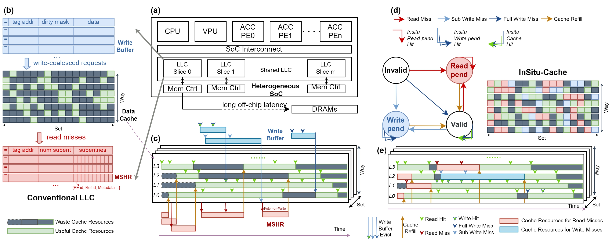

# 🚀 Insitu-Cache

**Insitu-Cache** is a **non-blocking, high-performance cache architecture** for modern heterogeneous SoCs.  
Its key insight is simple yet powerful: **Re-purpose wasted cache-line space for Write Buffer and MSHR fucntions**.
This “do more with what you already have” approach shrinks area, slashes latency, and keeps bandwidth-hungry accelerators happy.

<p align="center">
  
</p>

---

## ✨  Highlights

| 💡 | What makes Insitu-Cache special? |
|---|----------------------------------|
| 🏗️ | **In-situ write buffers & MSHRs** – no extra SRAM macros required. |
| 🔄 | **True non-blocking** operation even under heavy multi-core pressure. |
| ⏱️ | **Cycle-accurate SystemVerilog testbench** included. |
| 📐 | **Modular RTL**: drop-in compatible with ARM AXI or OpenPULP TCDM fabrics. |
| 📊 | **Area & energy breakdown scripts** (coming soon). |

---

## 🗂️  Repository Layout

<details>
<summary>Click to expand the directory tree</summary>

```text
Insitu-Cache/
├── include/
│   └── insitu_cache/
│       ├── assign.svh
│       └── hash.svh
├── src/
│   ├── cachepool/
│   │   └── cachepool_cache_ctrl.sv
│   ├── coalesce_unit/
│   │   ├── par_coalescer/
│   │   │   ├── non_coalescer.sv
│   │   │   ├── par_coalescer_equal_window.sv
│   │   │   ├── par_coalescer_extend_window.sv
│   │   │   ├── par_coalescer_top.sv
│   │   │   ├── req_coalescer_v2.sv
│   │   │   └── rsp_spliter_v2.sv
│   │   ├── seq_coalescer/
│   │   │   ├── seq_coalescer_multi_req_merger.sv
│   │   │   ├── seq_coalescer_req_merger.sv
│   │   │   └── seq_coalescer_top.sv
│   │   └── write_merger/
│   │       └── write_through_merger.sv
│   ├── dep/
│   │   └── dram_rtl_sim
│   ├── flamingo/
│   │   └── flamingo_spatz_cache_ctrl.sv
│   ├── insitu_cache/
│   │   ├── insitu_cache_core.sv
│   │   ├── insitu_cache_decoder.sv
│   │   ├── insitu_cache_encoder.sv
│   │   ├── insitu_cache_pkg.sv
│   │   ├── insitu_cache_tcdm_wrapper.sv
│   │   ├── insitu_cache_tcdm_wrapper_partitionable_flushable.sv
│   │   └── insitu_cache_top.sv
│   └── utilities/
│       ├── cache_to_axi.sv
│       ├── decouple_channels_adapter.sv
│       ├── decouple_queue_sync.sv
│       ├── dual_port_bank.sv
│       ├── dual_port_rf.sv
│       ├── id_buffer.sv
│       ├── pseudo_dual_port_bank.sv
│       ├── pseudo_dual_port_fifo.sv
│       └── pseudo_dual_port_way.sv
├── test/
│   └── tb_insitu_cache.sv
├── vsim/
│   └── start.tcl
├── Makefile
└── README.md
````

</details>

---

## 🏃‍♂️  Quick-Start: Simulate the Testbench

```bash
# Build Dramsys for insitu-cache testbench
source sourceme.sh
# Compile RTL, elaborate, and run in ModelSim/Questa
make vsim
```

> **Tip**
> The supplied `start.tcl` script drops you straight into the GUI with waveforms pre-loaded.

---

## 🛠️  Building Blocks

| Module                                | Role                                                        |
| ------------------------------------- | ----------------------------------------------------------- |
| `insitu_cache_core.sv`                | Core pipeline: tag, data, write-combining, and MSHR FSMs    |
| `par_coalescer_*` / `seq_coalescer_*` | Parallel and sequential request coalescers                  |
| `cachepool_cache_ctrl.sv`             | Dynamic allocation of “pool” lines for write-buffer entries |
| `utilities/`                          | Handy adapters (AXI bridges, dual-port banks, FIFOs)        |

---

## 📜  License

All hardware sources and tool scripts are licensed under the Solderpad Hardware License 0.51 (see `LICENSE`).
Feel free to use, modify, and star ⭐ the repo if you find Insitu-Cache helpful!


